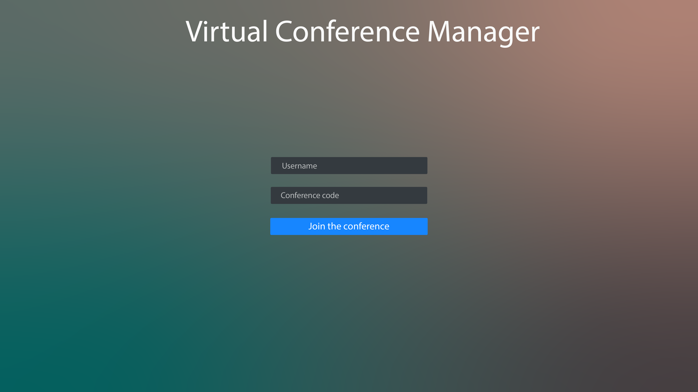
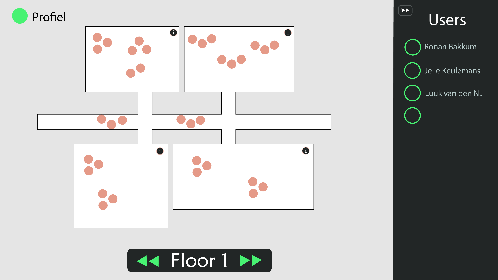
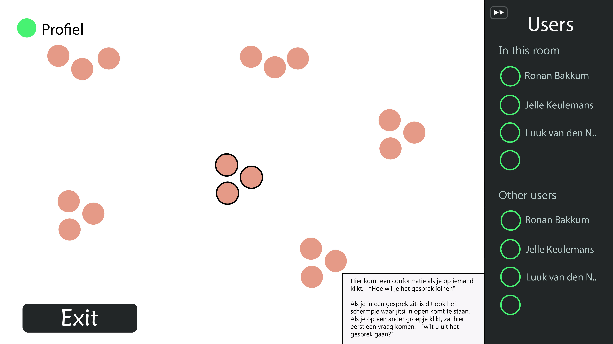

# login form

Users log in with a conference code and a username on this form.

We might have to use accounts because uploading images can be a pain. So the upload image button could be added here, but it'd not be as user-friendly.

# overview form

In this form users can:
- see all the floors
- access their profile status and settings
- see all the users and their status
- open a window with all conference info (not added to this design yet)
- click a room or hallway to zoom in and join it.

# room view

In this room users can:
- See users, both in the room and outside the room
- Click groups to join their call

All video logic is included in this room. When exiting the room, the call stops.

**real life**
You can also start a conversation with someone in real life and update the app so online users can see their avatars and ask to join their conversation. 

*I think it'd be really nice if on-site members can simply scan some qr code or another person to automatically sync the converstation with the online converstation view*.